# 琥珀Ho拆解报告

> ***Warning！！！***
>
> **拆机有风险，请谨慎拆机，目前尚未有完全无损拆机的方法，请完整阅读后进行决定。**

### 1. 机身结构

> ho机身大体由上下两部分构成，上半部分与下半部分通过金属连接件拼接而成，顶盖和底盖分别使用卡扣固定。

| 顶盖图                                                      | 底盖图                                                       | 金属连接件图                                                 |
| ----------------------------------------------------------- | ------------------------------------------------------------ | ------------------------------------------------------------ |
| 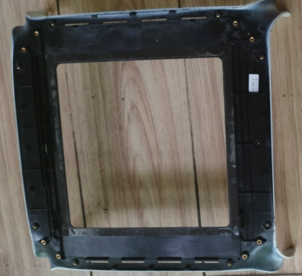 | 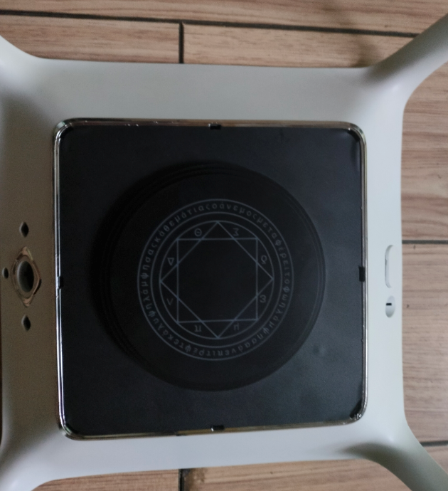 | 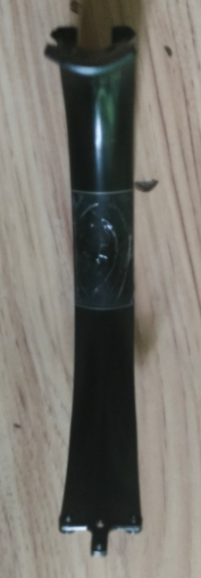 |

-----
> 使用如下图方式，连接上下两部分（金属连接件与外壳间夹有线缆）
> 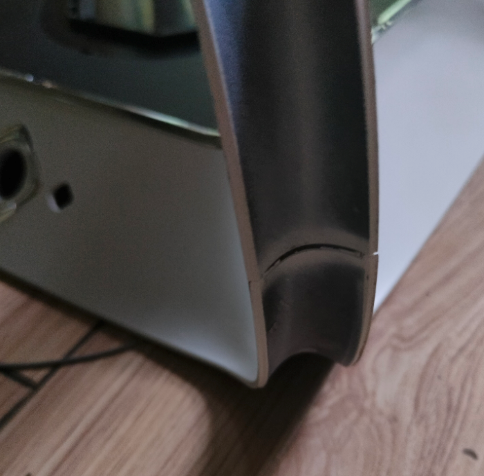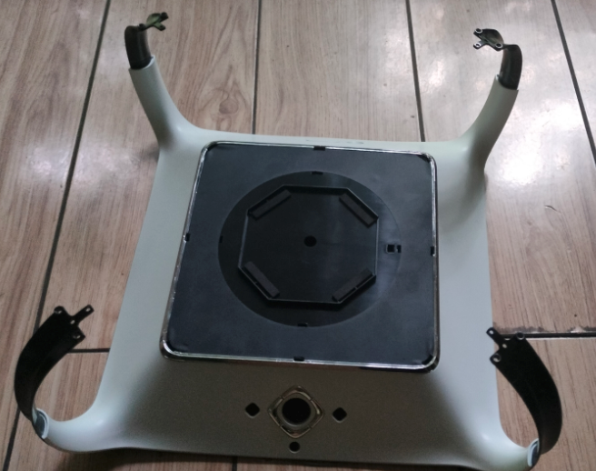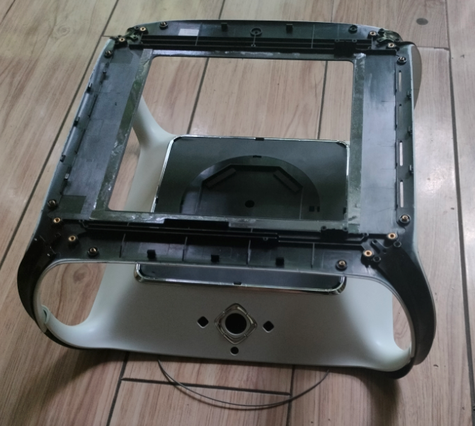

**结构总览图**

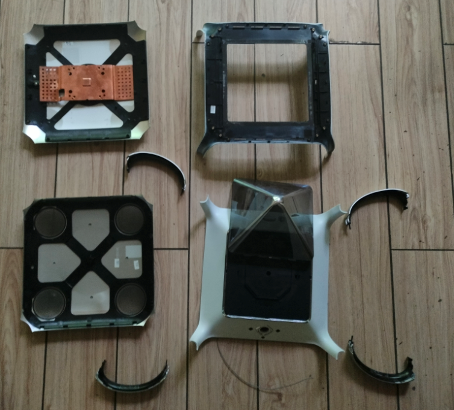

### 2. 功能概要

#### 上板

| 组件       | 图片                                                         | 注意事项                                                     |
| ---------- | ------------------------------------------------------------ | ------------------------------------------------------------ |
| 主板       | 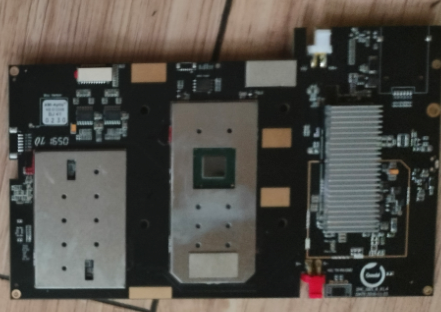                            |                                                              |
| 散热器     | 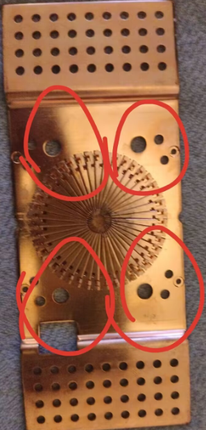     | **主板使用塑料铆钉卡死在散热器（红圈位置为铆钉的位置）上（如需拆解只能剪断塑料铆钉）**尚且无法做到无损拆机 |
| 屏幕       | 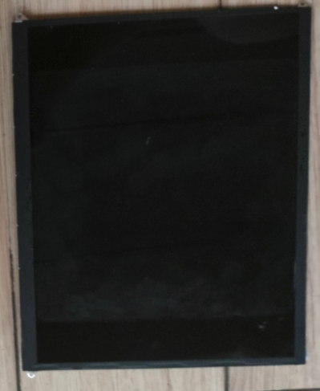         |                                                              |
| 麦克风阵列 | 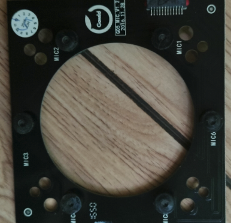 | 散热器与麦克风阵列使用螺丝固定于顶盖上方                     |

-----

#### 下板

| 组件       | 图片                                                        | 注意事项                                           |
| ---------- | ----------------------------------------------------------- | -------------------------------------------------- |
| 扬声器模组 | 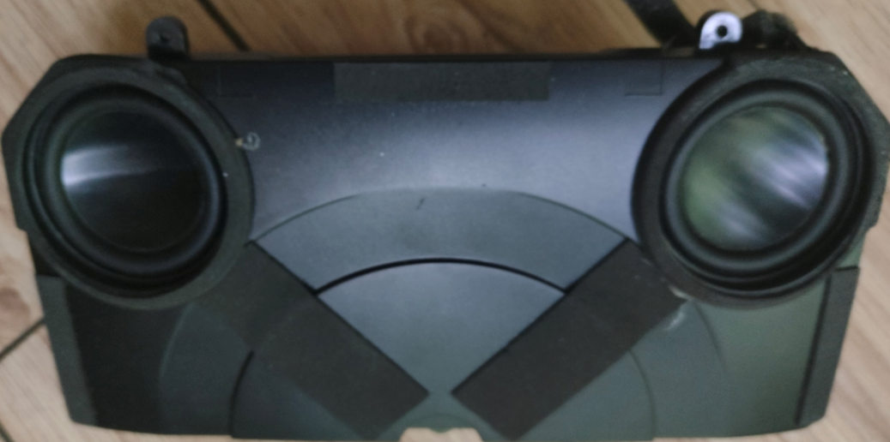     |                                                    |
| 按键板     | 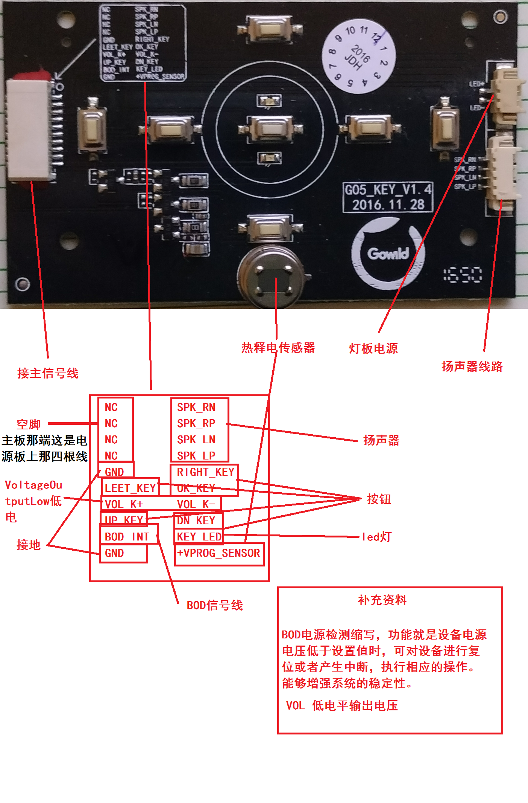    | 包含热释电传感器                                   |
| 电源板     | 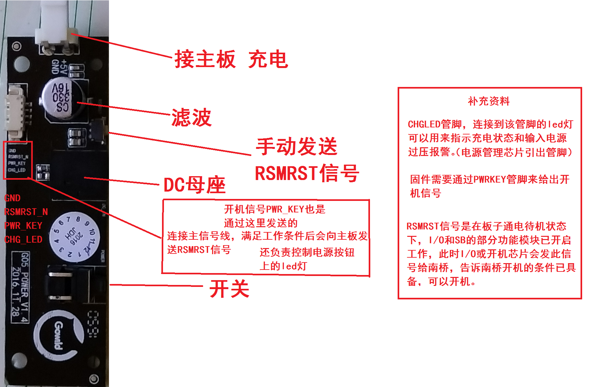     | 负责 滤波 充电状态指示 发送RSMRST信号 发送开机信号 |
| 电池       | 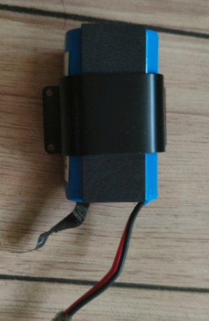         |                                                    |
| 灯板（正） | 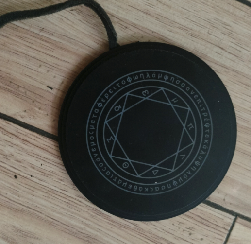 |                                                    |
| （反）     | 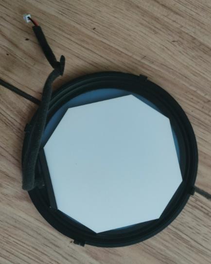         |                                                    |

### 3. 主板图解

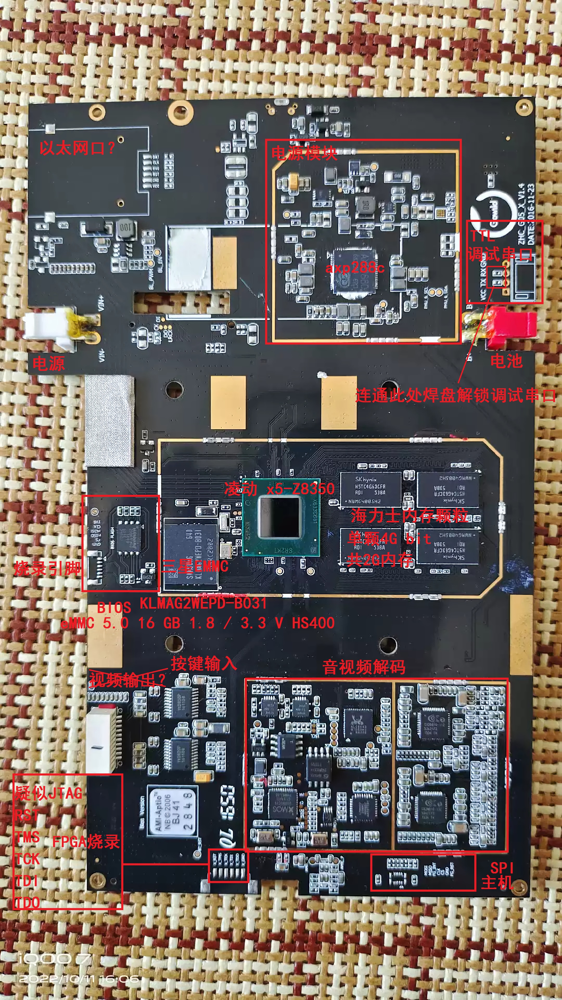

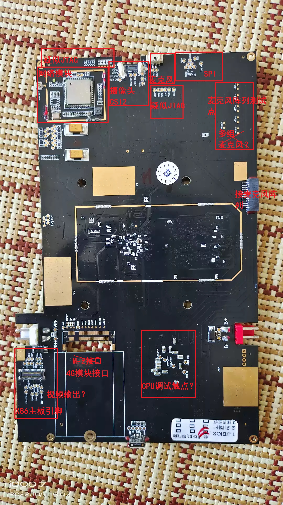

### 4. 拆卸指南

- **上盖拆卸**：先去除上半部分的螺丝（螺丝位于屏幕旁边）然后使用一字型螺丝刀撬开上盖即可（卡扣比较紧得多撬一下，每个边都有两个卡扣可能需要多把螺丝刀同时撬）
- **下盖拆卸**：除了没螺丝之外其他和上盖一样
- **上下部分分离**：先拆开上下盖然后移除上下盖四个角的32颗螺丝（每个角有四颗螺丝共八个角）并分离线缆，然后掰开黑色的金属连接件（连接件使用双面胶粘合上下两部分）即可分离上下部分
- **屏幕拆除**：先将主板移除然后加热上盖并用螺丝刀慢慢撬动屏幕边缘即可（屏幕是双面胶粘的）
- **塑料罩拆除**：使用螺丝刀慢慢撬（四个角有灌胶的圆角卡扣）
- **灯板拆除**：先移除下部分的其他元件然后使用一字型螺丝刀将卡扣斜着往下推，推出四个卡扣后即可取下灯板外壳，然后将线缆扯出即可拆除灯板
- **散热器拆除**：由于散热器使用塑料铆钉固定，无法完整拆除，只能使用钳子剪断四个塑料铆钉然后取下螺丝

> 本文第一作者为66hh
>
> 由futz12删改并发布
